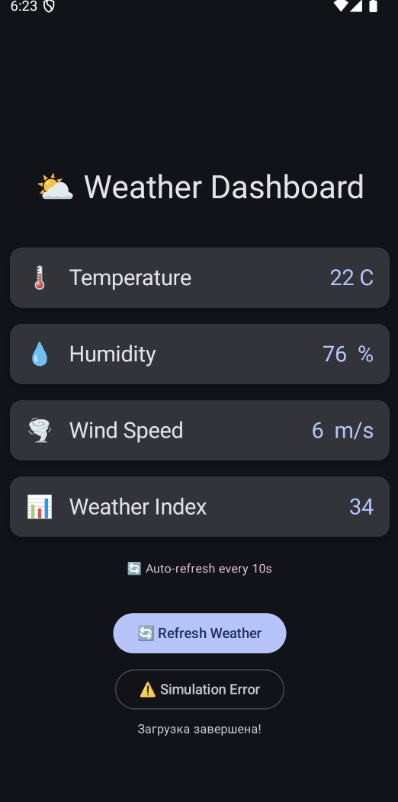

# Лабораторная работа №17-18. Корутины на практике: Метеосводка
---

## Основная информация
**ФИО**: Rudy Rudy Rudy
**Группа**: ИСП-233
**Дата**: 24.08.2077
---

## Описание проекта

Приложение демонстрирует работу с корутинами в Kotlin.
Оно показывает асинхронное выполнение задач, обработку ошибок и управление потоками без блокировки UI.

---

## Функциональность

- Запуск асинхронных задач с помощью корутин
- Обработка задержанных операций
- Использование различных диспетчеров
- Обработка исключений
- Автоматическая отмена корутин
- Работа с `viewModelScope`
- Неблокирующий пользовательский интерфейс

---

## Технологии и библиотеки

- Kotlin
- Android SDK
- kotlinx.coroutines
- Android Jetpack ViewModel
- LiveData или StateFlow

---

# Контрольные вопросы

## A) Разница между launch и async

- `launch` - не возвращает результат (Job)
- `async` - возвращает результат (Deferred)

Когда использовать:
- `launch` - когда результат не нужен
- `async` - когда нужен результат

Пример:

```kotlin
launch {
    println("Hello")
}

val result = async {
    5 + 5
}
println(result.await())
```

---

## B) Что такое suspend функция

Это функция, которая может приостанавливать выполнение без блокировки потока.

Можно ли вызвать из обычной функции:
- Нет, только из **coroutine** или другой suspend функции

Почему `delay()` не блокирует поток:
- Потому что приостанавливается корутина, а не поток

---

## C) Диспетчеры

Зачем нужны:
- Для управления потоками выполнения

Таблица:

| Диспетчер | Назначение | Пример |
|----------|-----------|--------|
| Main | UI поток | Обновление интерфейса |
| IO | Ввод/вывод | Работа с сетью |
| Default | Вычисления | Сложные расчёты |

Что будет при тяжёлой задаче на Main:
- Приложение зависнет (ANR)

---

## D) Исключения в корутинах

Если не обработать:
- Приложение может завершиться с ошибкой

Как обрабатывать:

```kotlin
launch {
    try {
        // код
    } catch (e: Exception) {
        println(e.message)
    }
}
```

Зачем try-catch внутри launch:
- Чтобы перехватить ошибки внутри корутины

---

## E) Отмена корутин

Как работает:
- Корутины отменяются вместе со scope

Что такое `viewModelScope`:
- Scope, связанный с жизненным циклом ViewModel

Когда отменяются:
- При уничтожении ViewModel
- При уничтожении Activity или Fragment

---

## Как запустить проект

1. Открыть проект в Android Studio
2. Нажать Run
3. Выбрать устройство

---

## Скриншоты

<div align="center">
        <p style="font-weight: bold; margin-bottom: 5px; color: #555;">🏠Home Screen</p>
        
</div>
